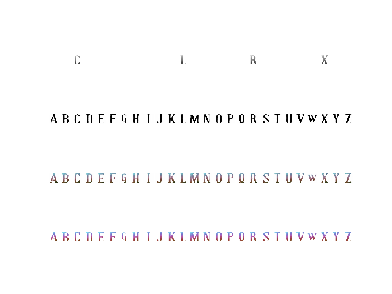

### Objective
Given a few colored and stylized texts of English alphabet generate remaining unobserved glyphs.  

### Overview
We implement 


### Dataset
The dataset(named `Capitals_colorGrad64` ) consists of stylized color images with 26 English alphabets. Each image is of size 64x64. An example image is given below
<p align='center'>
  
</p>

### Architecture
We divide the network into two stages each specialized for a particular task. The first network, glphyNet models the
overall glyph shape and structure. The second network, ornaNet models the appearance with color and texture, enabling the transfer of fine decorative elements. Each of these networks follow a conditional GAN architecture.   
<p align='center'>
  
  
</p>
<p align='center'>
    Fig: glyphNet (Left) and ornaNet(Right)  
</p>

### Training
Glyphnet is trained on the `Capitals_colorGrad64` dataset. Input to the glyphnet is a 64x64x26 tenspo  

### Result
The following images display the outputs from glyphNet. The first row prints the conditional input, second-row prints fake image output by generator and the third-row prints ground truth. We observe that glyphNet can correctly generalize the output shape given very few glyphs of the typeface.
<p align='center'>
  
  
</p>
<p align='center'>
    Fig: GlyphNet output  
</p>

The next set of images display the outputs from ornaNet. The first row prints the conditional input to glyphNet generator, second-row prints conditional input to ornaNet generator, third-row prints ornaNet prediction and fourth-row prints the ground truth. ornaNet can generalize with the image gradients patterns and color. 
<p align='center'>
  
  
</p>
<p align='center'>
    Fig: ornaNet output  
</p>

### Observations


## Requirements 
The following packages are a minimum requirement to run this project

```
numpy==1.16.2
matplotlib==3.0.2
tensorflow-gpu==1.12.0
Keras==2.2.4
```

### Starting Project
1. `git clone https://github.com/somil55/CV2019.git`
2. `cd CV2019`

### Installing Virtual Environment and required packages
1. `pip install virtualenv`
2. `virtualenv venv`
3. `source venv/bin/activate`
4. `pip install -r requirements.txt`

### Exiting Project
1. Run `pip freeze > requirements.txt` if you update or install additional packages and commit
2. Run `deactivate` to exit virtual environment
