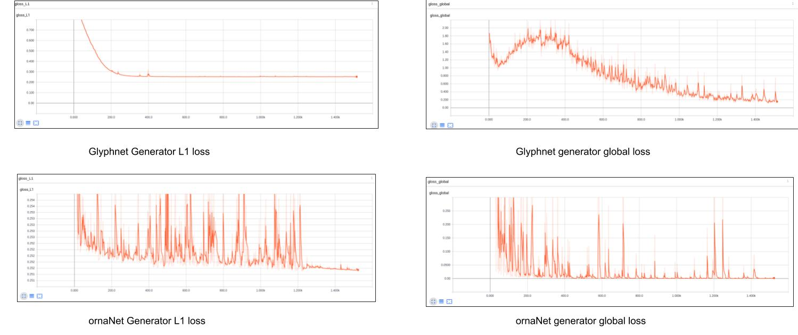
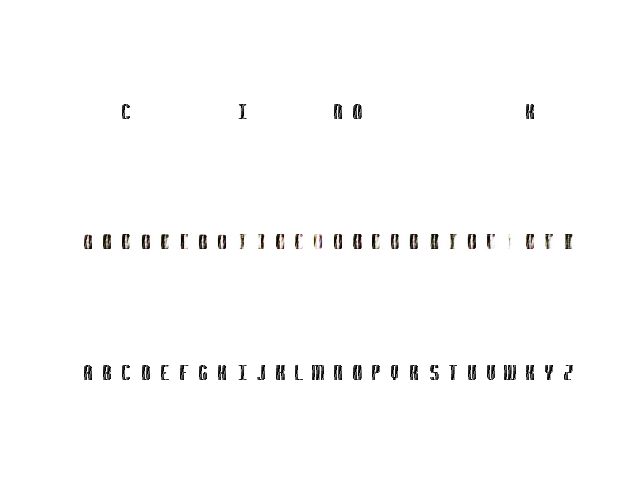

### Objective
Given a few colored and stylized texts of English alphabet generate remaining unobserved glyphs.  

### Overview
We implement MC-GAN architecture defined in [Multi-Content GAN for Few-Shot Font Style Transfer](https://arxiv.org/abs/1712.00516) to transfer glyph structure and style.  


### Dataset
The dataset(named `Capitals_colorGrad64` ) consists of stylized color images with 26 English alphabets. Each image is of size 64x64. An example image is given below
<p align='center'>
  
</p>

### Architecture
We divide the network into two stages each specialized for a particular task. The first network, glphyNet models the
overall glyph shape and structure. The second network, ornaNet models the appearance with color and texture, enabling the transfer of fine decorative elements. Each of these networks follow a conditional GAN architecture. Generator is basically an encoder decoder model and ensures that input and output are of same dimension. Descriminator consist of a local and
global discriminator where weights of the local discriminator is shared with the latter. Receptive field of global discriminator is whole image.  
<p align='center'>
  
  
</p>
<p align='center'>
    Fig: glyphNet (Left) and ornaNet(Right)  
</p>

### Training
GlyphNet is trained on the `Capitals_colorGrad64` dataset.  All know and unknown alphabets are tiled across channels resulting in the input of size 64x64x26. Each unknown alphabet channel is set to one. An additional L1 loss is applied between the output of the generator and ground truth. 
ornaNet is trained following leave one out approach. For a known set of alphabet, we create a batch consisting of all know letters except one letter. We pass this batch through the glyphNet and obtain the corresponding letter for the left out alphabet. To obtain unknown alphabets we pass all the know alphabets through glyphNet. This is taken as ornaNet conditional input.
<p align='center'>
  
</p>

### Baseline
We implemented a baseline using image-to-image translation network for this task. In this baseline approach, we consider channel-wise letters in input and output stacks with dimensions B × 78 × 64 × 64, where B stands for training batch size and 78 corresponds to the 26 RGB channels. The input stack is given with "observed" color letters while all letters are generated in the output stack. We train this network on o`Capitals_colorGrad64` where we have applied randomly chosen color gradients on each grayscale font. Feeding in a random subset of RGB letters of an arbitrary font into this model during test time, it is expected to generate stylistically similar 26 letters. The figure below gives an output obtained using baseline. The first row prints the conditional input, second-row prints fake image output and third-row prints ground truth.
<p align='center'>
  
</p>
<p align='center'>
    Fig: Baseline
</p>

### Result
The following images display the outputs from glyphNet. The first row prints the conditional input, second-row prints fake image output by generator and the third-row prints ground truth. We observe that glyphNet can correctly generalize the output shape given very few glyphs of the typeface.
<p align='center'>
  
  
</p>
<p align='center'>
    Fig: GlyphNet output  
</p>

The next set of images display the outputs from ornaNet. The first row prints the conditional input to glyphNet generator, second-row prints conditional input to ornaNet generator, third-row prints ornaNet prediction and fourth-row prints the ground truth. ornaNet can generalize with the image gradients patterns and color. 
<p align='center'>
  
  
</p>
<p align='center'>
    Fig: ornaNet output  
</p>

### Requirements 
The following packages are a minimum requirement to run this project

```
numpy==1.16.2
matplotlib==3.0.2
tensorflow-gpu==1.12.0
Keras==2.2.4
```
